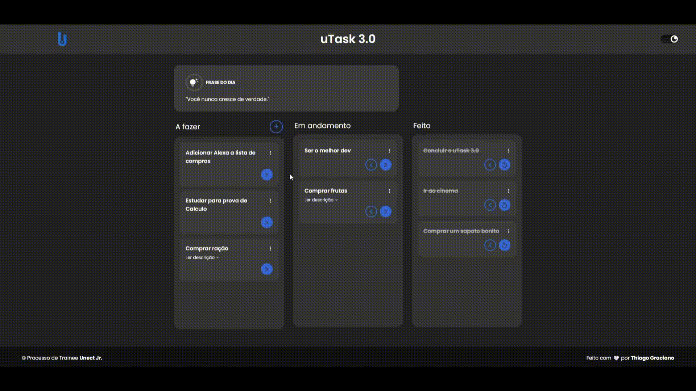
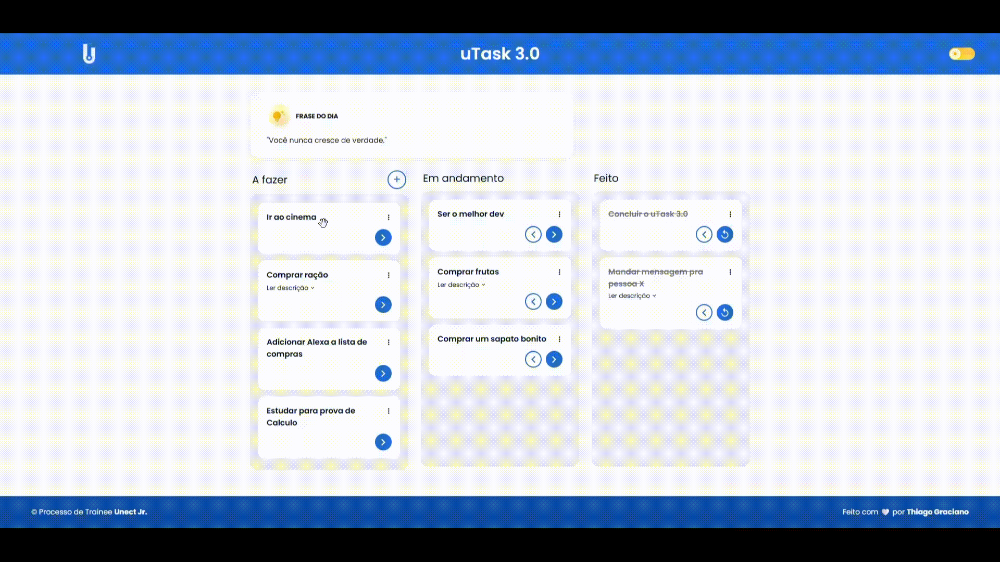
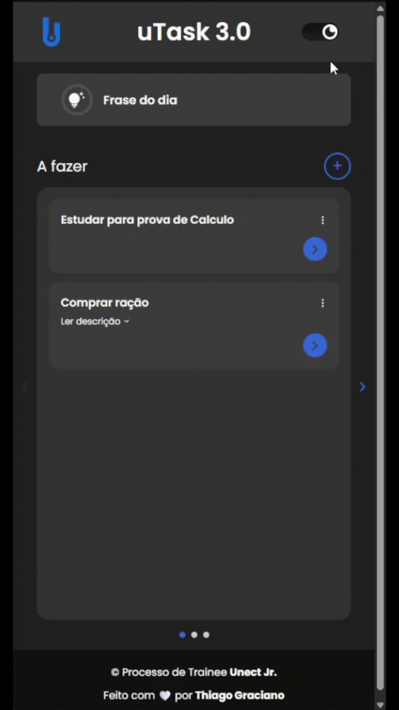
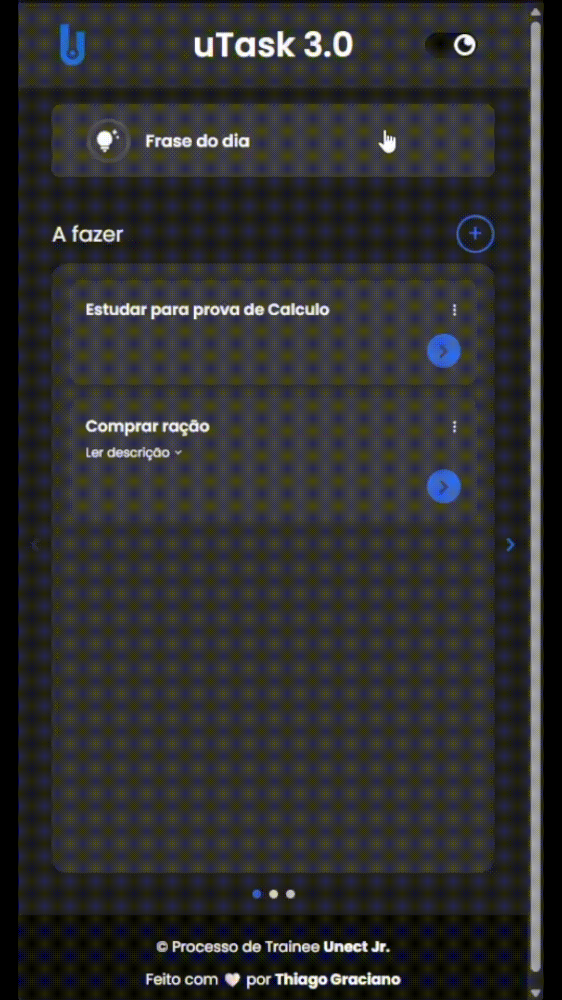
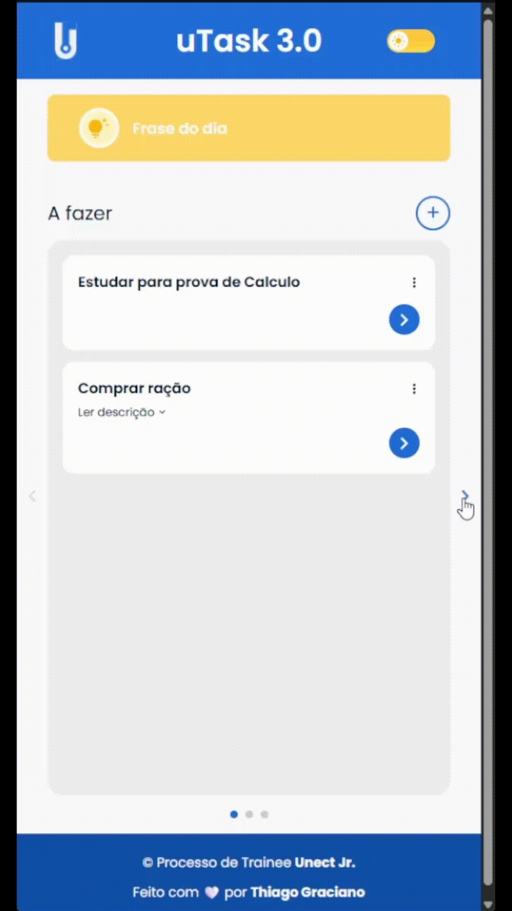
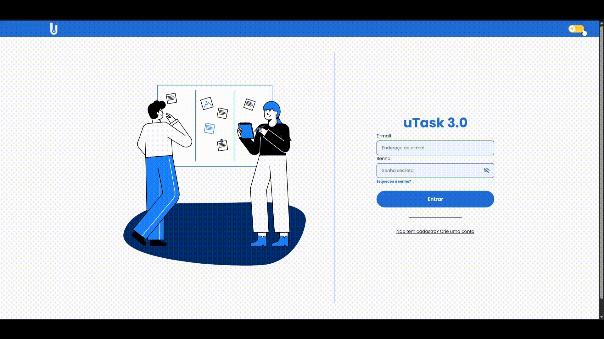
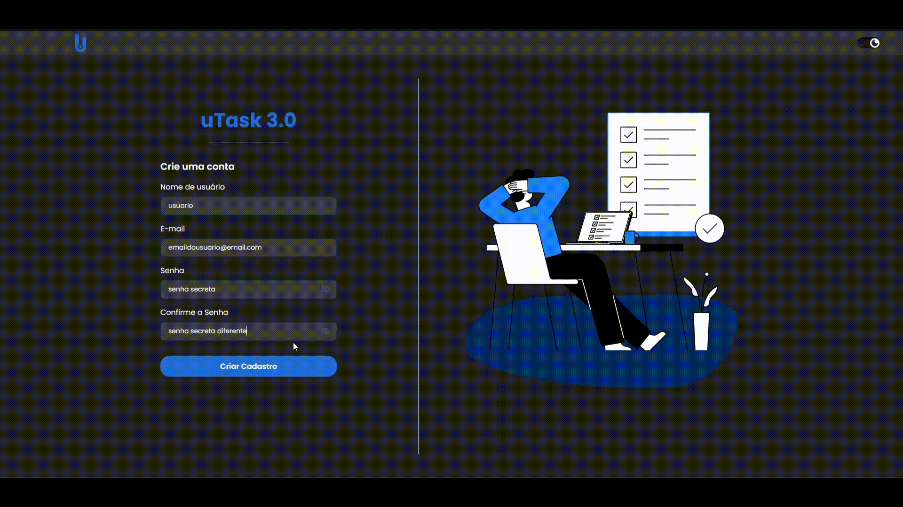

# 🚀 uTask 3.0

O uTask 3.0 é uma aplicação web de gerenciamento de tarefas inspirada no Trello. O objetivo é permitir que usuários criem, organizem e acompanhem suas tarefas através de um board Kanban com as colunas **To Do**, **Doing** e **Done**.

---

## ✨ Features

- 🔐 Autenticação JWT
- 📋 Sistema Kanban
- 🌙 Dark / Light Mode
- 📱 Responsividade Mobile
- ⚡ Frontend moderno com React + Vite
- 🛠 Backend com Fastify + PostgreSQL
- 🔄 Integração completa entre Frontend e Backend

---

## 🛠 Tecnologias

### Frontend
- React
- TypeScript
- Vite
- Axios
- Context API
- React Router DOM
- CSS

### Backend
- Fastify
- PostgreSQL
- TypeORM
- JWT (@fastify/jwt)
- bcrypt

---

# 🎥 Preview do Projeto

## 🌙 Kanban — Dark Mode

<p align="center">
  
</p>

---

## ☀️ Kanban — Light Mode

<p align="center">
  
</p>

---

## 📱 Mobile Responsivo

### Mobile — Dark & Light Mode

<p align="center">
  
  
  
</p>

---

## 🔐 Login & Cadastro

### Dark & Light Mode

<p align="center">
  
</p>

---

## ⚠️ Validação de Senha

<p align="center">
  
</p>

---

# ✅ Funcionalidades

## 🔐 Autenticação
- [x] Cadastro de usuário com senha criptografada (bcrypt)
- [x] Login com geração de token JWT
- [x] Middleware protegendo rotas privadas
- [x] Persistência de autenticação

---

## 📋 Sistema de Tarefas
- [x] Criar tarefas
- [x] Listar tarefas do usuário autenticado
- [x] Atualizar status das tarefas
- [x] Deletar tarefas
- [x] Organização em Kanban
- [x] Frase motivacional do dia

---

## 🎨 Interface
- [x] Tema claro e escuro
- [x] Responsividade Mobile
- [x] Layout moderno
- [x] Feedback visual para ações do usuário

---

# 🧠 Arquitetura

```text 
Frontend (React + Vite)
        ↓
API REST (Fastify)
        ↓
PostgreSQL (TypeORM)
```
---

# 📂 Estrutura do Projeto

```bash
uTask-3.0/
│
├── FrontEnd/
│   ├── src/
│   ├── public/
│   └── ...
│
├── BackEnd/
│   ├── src/
│   ├── routes/
│   ├── database/
│   └── ...
│
├── assets/
│   ├── kanban-dark-mode.gif
│   ├── kanban-light-mode.gif
│   ├── dark-e-light-mode.gif
│   ├── frase-do-dia-mobile-dark-e-light-mode.gif
│   └── ...
│
└── README.md
```

## ⚙️ Como Rodar Localmente

📌 Pré-requisitos
- Node.js 18+
- PostgreSQL instalado e rodando

## 1️⃣ Clone o repositório

```bash
git clone https://github.com/Thiago-Graciano/uTask-3.0.git
cd uTask-3.0
```

## 💻 Frontend

```bash
cd FrontEnd
npm install
npm run dev
```

## 🔧 Backend
```
cd BackEnd
npm install
```

Crie um arquivo .env dentro da pasta BackEnd/:

```
DB_HOST=localhost
DB_PORT=5432
DB_USER=seu_usuario
DB_PASS=sua_senha
DB_NAME=utask_db
JWT_SECRET=sua_chave_jwt
```

## 🚧 Roadmap

- ✅Autenticação JWT
- ✅CRUD de tarefas
- ✅Responsividade
- ✅Dark / Light Mode
- ✅Sistema Kanban
- ⬜Drag and Drop avançado
- ⬜Melhorias de acessibilidade
- ⬜Refatoração visual com Tailwind CSS

## 📚 Aprendizados

Durante o desenvolvimento do uTask 3.0, tive contato prático com:

- Arquitetura Fullstack
- Integração Frontend + Backend
- Autenticação JWT
- Persistência de dados
- Organização de componentes
- Context API
- Responsividade
- Estruturação de APIs REST
- TypeORM e PostgreSQL
- Boas práticas de organização de código

## 👨‍💻 Autor

Feito por **Thiago Graciano**

🔗 GitHub:
https://github.com/Thiago-Graciano

🔗 LinkedIn:
https://www.linkedin.com/in/thiago-graciano-eng/

## ⭐ Considerações Finais

O uTask 3.0 representa minha evolução prática no desenvolvimento Fullstack durante o processo trainee da UNECT Jr.

Mais do que apenas desenvolver funcionalidades, o projeto me ajudou a entender melhor conceitos como organização de código, separação de responsabilidades, integração entre sistemas e construção de aplicações modernas focadas na experiência do usuário.
